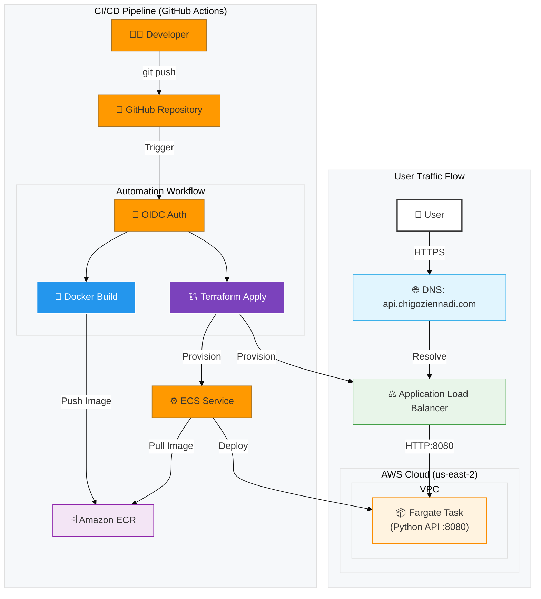

# Serverless Container Deployment on AWS ECS

[](https://github.com/Chariis/ecs-api/actions/workflows/deploy.yml)

**Live URL:** [http://api.chigoziennadi.com](http://api.chigoziennadi.com)

This project demonstrates a production-grade, containerized application deployment on AWS. It leverages **Docker** for containerization, **AWS ECS Fargate** for serverless orchestration, and **Terraform** for Infrastructure as Code (IaC). The entire lifecycle is automated via a **GitHub Actions** CI/CD pipeline.

---

## 🏗️ Architecture

The infrastructure is designed for high availability and security, utilizing a serverless architecture to eliminate OS management overhead.




### Infrastructure Components
* **Compute:** AWS ECS Fargate (Serverless Container Orchestration).
* **Networking:** Application Load Balancer (ALB) routing traffic across multiple subnets.
* **Registry:** Amazon ECR (Elastic Container Registry) for private image storage.
* **Security:** Granular Security Groups allowing traffic only from the Load Balancer to the container.
* **DNS:** Custom subdomain routing via Namecheap CNAME records.

### Automation & DevOps
* **IaC:** Terraform manages all AWS resources (VPC, ALB, ECS, IAM roles).
* **State Management:** Terraform state is stored securely in a remote S3 backend with DynamoDB locking to prevent race conditions.
* **CI/CD:** GitHub Actions handles Docker builds, ECR pushes, and Terraform deployment on every push to `main`.
* **Security:** Pipeline authenticates via **OpenID Connect (OIDC)**, eliminating the need for long-lived AWS access keys in GitHub secrets.

---

## ✨ Key Features

* **Zero-Server Management:** Uses AWS Fargate to run containers without provisioning EC2 instances.
* **Zero-Downtime Deployment:** The pipeline updates the ECS service with new image tags automatically.
* **Cost Optimized:** Infrastructure is codified to allow easy scaling to zero (0 tasks) when not in use to minimize costs.
* **Security Best Practices:**
    * Containers run in private subnets (simulated via Security Groups in Default VPC).
    * ALB listens on HTTP (port 80) and forwards to container port 8080.
    * Containers reject direct internet traffic; they only accept traffic from the ALB.

---

## 🛠️ Tech Stack

| Category | Technology | Usage |
| :--- | :--- | :--- |
| **Application** | Python (Flask) | Simple REST API with health checks. |
| **Containerization** | Docker | Packaging the application runtime. |
| **Orchestration** | AWS ECS Fargate | Running the container at scale. |
| **Infrastructure** | Terraform | Provisioning AWS resources. |
| **Registry** | Amazon ECR | Storing Docker images. |
| **CI/CD** | GitHub Actions | Automated build and deploy pipeline. |
| **Networking** | AWS ALB | Load balancing traffic. |

---

## 📂 Repository Structure

The project is organized to separate application source code from infrastructure definitions.

```text
/
├── .github/workflows/
│   └── deploy.yml                     # GitHub Actions Workflow (Build + Infra + Deploy)
│
├── app/                               # Application Source Code
│   ├── app.py                         # Flask API entry point
│   ├── Dockerfile                     # Docker image definition
│   └── requirements.txt               # Python dependencies
|
├── infra/                             # Terraform Infrastructure Code
│   ├── main.tf                        # Resource definitions (ALB, ECS, SG, IAM)
│   ├── backend.tf                     # Remote state configuration (S3 + DynamoDB)
│   ├── provider.tf                    # AWS Provider configuration
│   ├── variables.tf                   # Configurable variables (Region, App Name)
│   └── outputs.tf                     # Outputs (ALB DNS Name, ECR URL)
```